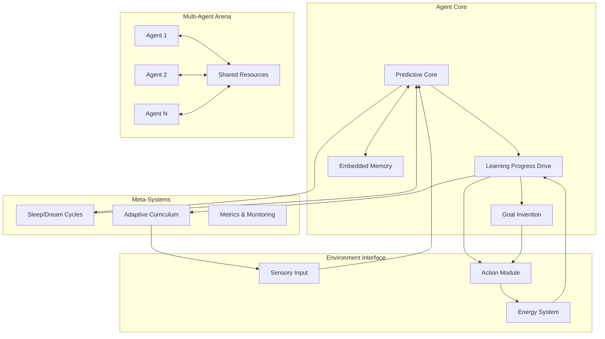

# Design Document

## Overview

The Adaptive Learning Agent is built around a core philosophy of emergent intelligence through intrinsic motivation. The system consists of interconnected components that work together to create a digital organism capable of autonomous learning, goal generation, and robust behavior under survival pressure.

The architecture follows a biological metaphor where intelligence emerges from the right environmental conditions rather than explicit programming. The agent develops through a "digital childhood" where curiosity, boredom, and survival instincts drive learning and adaptation.

## Architecture

### High-Level System Architecture



### Core Processing Loop

1. **Sensory Input Processing**: Raw sensory data enters the predictive core
2. **Prediction Generation**: The core generates predictions for next sensory states
3. **Learning Progress Calculation**: Prediction accuracy changes are computed
4. **Action Selection**: Actions are chosen to maximize learning progress and energy
5. **Memory Update**: Embedded memory is updated through Hebbian-like mechanisms
6. **Goal Management**: High-LP experiences are clustered into potential goals
7. **Energy Management**: Actions consume energy, survival behaviors replenish it

## Components and Interfaces

### 1. Predictive Core

**Architecture**: Recurrent State-Space Model (Mamba/HGRN preferred, LSTM fallback)

**Key Components**:
- **State Encoder**: Converts sensory input to internal state representation
- **Temporal Predictor**: Generates next-state predictions using recurrent dynamics
- **Prediction Head**: Outputs sensory predictions and confidence estimates
- **State Memory**: Maintains temporal context across prediction steps

**Interface**:
```python
class PredictiveCore:
    def forward(self, sensory_input: Tensor, hidden_state: Tensor) -> Tuple[Tensor, Tensor, Tensor]:
        # Returns: prediction, new_hidden_state, confidence
        
    def compute_prediction_error(self, prediction: Tensor, actual: Tensor) -> Tensor:
        # Returns: prediction error magnitude
```

**Implementation Details**:
- Input dimensionality: Configurable (start with 64x64 visual + proprioception)
- Hidden state size: 512-1024 dimensions
- Prediction horizon: 1-5 steps ahead
- Loss function: MSE for continuous, CrossEntropy for discrete sensory modalities

### 2. Learning Progress Drive

**CRITICAL RISK MITIGATION**: The LP drive is the highest-risk component. Implementation requires extensive validation.

**Core Algorithm (with stability measures)**: 
```
# Multi-modal normalization
normalized_error_i = prediction_error_i / running_std_i
# Robust smoothing with outlier rejection
smooth_error = exponential_moving_average(normalized_error, alpha=0.01)
# Clamped derivative to prevent noise amplification
LP(t) = clamp(-d(smooth_error)/dt, min=-1.0, max=1.0)
# Hybrid reward with fallback
reward(t) = 0.7 * LP(t) + 0.3 * empowerment_bonus(t)
```

**Validation Requirements**:
- **Offline Testing**: Must validate LP signal stability on recorded data streams before integration
- **Online Loop Validation**: Critical "Stage 1.5" testing of LP signal stability in closed-loop with agent actions
- **Modality Normalization**: Per-sensory-channel error normalization with variance tracking and stability checks
- **Cheat Detection**: Monitor for "dark corner" exploits via environmental diversity metrics
- **Dynamic Balancing**: Adaptive weighting between LP and empowerment (start with fixed 0.7/0.3, activate adaptive logic only if conflicts observed)
- **Stress Testing**: Validate LP stability under novel sensory input with high variance (normalization stress test)
- **Signal Quality Metrics**: Automated validation pipeline with LP signal quality assessment

**Critical Implementation Notes**:
- **Validation Trap Awareness**: Offline validation is necessary but not sufficient - expect different behavior in closed-loop
- **Feedback Loop Monitoring**: Watch for oscillations and instabilities when LP signal influences actions that change data distribution

**Components**:
- **Error Tracker**: Maintains per-modality running statistics with variance tracking and stability monitoring
- **Progress Calculator**: Computes robust derivative with adaptive bounds and outlier rejection
- **Dynamic Reward Generator**: Adaptive weighting between LP and empowerment with conflict detection
- **Exploit Detector**: Monitors environmental diversity and reward signal conflicts
- **Signal Validator**: Real-time LP signal quality assessment and anomaly detection

**Interface**:
```python
class LearningProgressDrive:
    def compute_reward(self, prediction_error: Tensor) -> Tensor:
        # Returns: intrinsic reward signal
        
    def is_bored(self) -> bool:
        # Returns: True if LP has been near zero for threshold steps
        
    def reset_boredom_counter(self):
        # Called when new goals are invented or complexity increases
```

**Parameters**:
- Smoothing window: 100-1000 steps
- Boredom threshold: LP < 0.01 for 500+ steps
- Reward scaling: Configurable multiplier for RL integration

### 3. Embedded Memory System

**CRITICAL RISK MITIGATION**: Pure Hebbian updates are unstable. Using proven memory-augmented architecture.

**Architecture**: Differentiable Neural Computer (DNC) with Hebbian-inspired components

**Rationale**: Addresses the "external notebook" critique while providing proven stability and scalability.

**Components**:
- **Content-Addressable Memory**: External memory matrix with read/write heads
- **Hebbian-Inspired Addressing**: Usage-based memory allocation with co-activation bonuses
- **Temporal Linking**: Maintains sequence information for episodic memory
- **Memory Controller**: Learned read/write operations integrated with predictive core

**Interface**:
```python
class EmbeddedMemory:
    def __init__(self, memory_size: int = 512, word_size: int = 64):
        self.memory_matrix = torch.zeros(memory_size, word_size)
        self.usage_vector = torch.zeros(memory_size)
        
    def read_write_step(self, controller_output: Tensor) -> Tuple[Tensor, Tensor]:
        # Returns: read_vectors, updated_memory_state
        
    def hebbian_bonus(self, read_weights: Tensor, write_weights: Tensor):
        # Adds co-activation bonus to memory addressing
```

**Implementation**:
- Memory matrix: 512 x 64 (32KB external memory)
- Addressing: Content + location + Hebbian co-activation bonus
- Stability: Proven DNC architecture with gradient flow
- Integration: Memory reads/writes are part of forward pass

**DNC Training Strategy**:
```python
class MemoryDiagnostics:
    def compute_memory_usage(self, read_weights: Tensor, write_weights: Tensor) -> Dict[str, float]:
        return {
            "memory_utilization": (read_weights.sum(dim=1) > 0.1).float().mean(),
            "write_diversity": torch.std(write_weights, dim=1).mean(),
            "read_concentration": (read_weights.max(dim=1)[0]).mean(),
            "gradient_flow_health": self.monitor_gradient_flow(),
            "co_adaptation_score": self.measure_core_memory_cooperation()
        }
        
    def memory_utilization_regularizer(self, hidden_state: Tensor, memory_reads: Tensor) -> Tensor:
        # Penalize high hidden state activity when memory is available
        return torch.norm(hidden_state) * torch.exp(-torch.norm(memory_reads))
```

**Memory Learning Validation**:
- **Pre-training**: DNC must master copy tasks and associative recall before integration
- **Regularization**: Encourage memory use over hidden state reliance through loss terms
- **Co-adaptation Monitoring**: Track predictive core vs memory controller cooperation
- **Gradient Flow Analysis**: Monitor training stability through memory operations
- **Usage Monitoring**: Track memory utilization with automated alerts if usage drops below 10%
- **Ablation Testing**: Compare performance with/without external memory across multiple runs

### 4. Sleep and Dream Cycles

**Trigger Conditions**:
- Energy below 20% of maximum
- Boredom detected (low LP for extended period)
- Memory capacity approaching limits
- Scheduled intervals (every N steps)

**Sleep Process**:
1. **Experience Replay**: Sample high-error experiences from replay buffer
2. **Offline Training**: Update predictive core on replayed experiences
3. **Memory Consolidation**: Strengthen important fast weight connections
4. **Pruning**: Remove low-value memories and connections
5. **Distillation**: Compress learned patterns into more efficient representations

**Interface**:
```python
class SleepCycle:
    def should_sleep(self, energy: float, boredom: bool, memory_usage: float) -> bool:
        
    def execute_sleep_cycle(self, replay_buffer: List[Experience]):
        # Performs offline learning and memory consolidation
        
    def dream_rollouts(self, num_rollouts: int):
        # Generates synthetic experiences for learning
```

### 5. Energy and Death System

**Energy Dynamics**:
- Base consumption: 0.01 per step
- Action cost: 0.1-1.0 per action (based on action magnitude)
- Computation cost: Proportional to model forward passes
- Energy sources: Environmental "food" objects (+10.0 energy)
- Maximum energy: 100.0 units

**Death Mechanism**:
- Trigger: Energy ≤ 0
- Reset: Agent position, energy, and recurrent hidden state
- Preservation Strategy: **Learned Meta-Memory System**

**Precise Death/Rebirth Protocol**:
```python
class DeathManager:
    def __init__(self):
        self.importance_network = nn.Linear(memory_size, 1)  # Learns what to preserve
        
    def compute_memory_importance(self, memory_matrix: Tensor, usage_history: Tensor) -> Tensor:
        # Neural network learns which memories are worth preserving
        importance_scores = self.importance_network(memory_matrix)
        # Combine with usage frequency
        final_scores = importance_scores.squeeze() * usage_history
        return final_scores
        
    def selective_reset(self, agent_state: AgentState) -> AgentState:
        importance = self.compute_memory_importance(agent_state.memory, agent_state.usage_history)
        # Preserve top 20% of memories by importance
        preserve_mask = importance > torch.quantile(importance, 0.8)
        
        new_state = AgentState(
            position=self.random_spawn_position(),
            energy=100.0,
            hidden_state=torch.zeros_like(agent_state.hidden_state),  # Reset recurrent state
            memory=agent_state.memory * preserve_mask.unsqueeze(1),   # Selective memory preservation
        )
        return new_state
```

**Phased Implementation Strategy**:
- **Phase 1**: Rule-based importance heuristics (access frequency + LP correlation)
- **Phase 2**: Learned importance network trained via REINFORCE on collected death/rebirth data
- **Meta-Learning Objective**: The importance network maximizes post-death recovery speed
- **Training Protocol**: REINFORCE-style policy gradient rewarding faster learning in new lifetimes

```python
class DeathManager:
    def __init__(self, use_learned_importance: bool = False):
        self.use_learned = use_learned_importance
        self.heuristic_scorer = HeuristicImportanceScorer()
        self.learned_network = ImportanceNetwork() if use_learned else None
        
    def compute_memory_importance(self, memory_matrix: Tensor, usage_history: Tensor) -> Tensor:
        if not self.use_learned:
            # Rule-based heuristics for Phase 1 stability
            return self.heuristic_scorer.score(memory_matrix, usage_history)
        else:
            # Learned network for Phase 2 optimization
            return self.learned_network(memory_matrix, usage_history)
```

**Interface**:
```python
class EnergySystem:
    def consume_energy(self, action_cost: float, computation_cost: float):
        
    def add_energy(self, amount: float):
        
    def is_dead(self) -> bool:
        
    def reset_agent(self):
        # Handles death and respawn
```

### 6. Goal Invention System

**CRITICAL RISK MITIGATION**: Phased approach starting with simple, validated goals before attempting emergent discovery.

**Phase 1: Fixed Survival Goals**
- Hard-coded goals: "find food", "avoid death", "maintain energy > 50%"
- Success metric: Binary achievement with clear environmental feedback
- Purpose: Validate energy system and basic RL learning

**Phase 2: Template-Based Goals**
- Goal templates: "reach location (x,y)", "interact with object type X"
- Parameter generation: Random sampling within environment bounds
- Achievement: Clear spatial/interaction criteria

**Phase 3: Emergent Goal Discovery (Future)**
- Experience clustering in validated latent representations
- Goal validation through achievability testing
- Automatic difficulty adjustment based on success rates

**Interface**:
```python
class GoalInvention:
    def __init__(self, phase: str = "survival"):
        self.current_phase = phase
        
    def get_active_goals(self, agent_state: AgentState) -> List[Goal]:
        if self.current_phase == "survival":
            return self._survival_goals(agent_state)
        elif self.current_phase == "template":
            return self._template_goals(agent_state)
            
    def evaluate_achievement(self, goal: Goal, agent_state: AgentState) -> bool:
        # Clear, deterministic achievement criteria
```

**Validation Strategy**:
- Phase 1 must achieve 80%+ survival rate before Phase 2
- Phase 2 must show consistent goal achievement before Phase 3
- Each phase validates core assumptions before adding complexity

### 7. Multi-Agent Arena

**CRITICAL RISK MITIGATION**: Multi-agent complexity is deferred until single-agent system is proven stable.

**Development Phases**:

**Phase 1: Single Agent Validation (Months 1-6)**
- Isolated agent in controlled environment
- Focus: Validate LP drive, memory system, energy mechanics
- Success criteria: Stable learning, goal achievement, survival

**Phase 2: Dual Agent Introduction (Month 7+)**
- Two agents in separate but observable spaces
- Limited interaction: visual observation only
- Purpose: Test system stability under observation

**Phase 3: Competitive Multi-Agent (Month 9+)**
- Shared resources and direct competition
- Full interaction dynamics
- Prerequisite: Both single agents must be independently stable

**Current Implementation (Phase 1 Only)**:
```python
class SingleAgentEnvironment:
    def __init__(self, complexity_level: int = 1):
        self.complexity = complexity_level
        
    def step(self, action: Action) -> Observation:
        # Controlled, debuggable single-agent environment
        
    def increase_complexity(self):
        # Gradual complexity scaling based on agent performance
```

**Rationale**: Multi-agent interactions will amplify any single-agent instabilities. The system must be rock-solid with one agent before introducing the chaos of social dynamics.

## Data Models

### Core Data Structures

```python
@dataclass
class SensoryInput:
    visual: Tensor  # Shape: [channels, height, width]
    proprioception: Tensor  # Shape: [joint_angles, velocities]
    energy_level: float
    timestamp: int

@dataclass
class Prediction:
    next_sensory: SensoryInput
    confidence: Tensor
    prediction_error: float

@dataclass
class Experience:
    state: SensoryInput
    action: Tensor
    next_state: SensoryInput
    learning_progress: float
    energy_change: float
    timestamp: int

@dataclass
class Goal:
    target_state_cluster: Tensor  # Centroid in latent space
    achievement_radius: float
    success_rate: float
    learning_progress_history: List[float]
    creation_timestamp: int

@dataclass
class AgentState:
    position: Tensor  # 3D coordinates
    orientation: Tensor  # Quaternion
    energy: float
    hidden_state: Tensor  # Recurrent model state
    active_goals: List[Goal]
    memory_state: Tensor  # Fast weights
```

### Memory Structures

```python
class ReplayBuffer:
    def __init__(self, capacity: int = 100000):
        self.experiences: Deque[Experience] = deque(maxlen=capacity)
        
    def add(self, experience: Experience):
        
    def sample_high_error(self, batch_size: int) -> List[Experience]:
        # Prioritized sampling based on prediction error

class GoalMemory:
    def __init__(self):
        self.active_goals: List[Goal] = []
        self.retired_goals: List[Goal] = []
        
    def add_goal(self, goal: Goal):
        
    def retire_goal(self, goal: Goal):
```

## Critical Risk Mitigation Strategies

### Bootstrap Problem Solution

**The Challenge**: Newborn agent with random actions produces massive, noisy prediction errors that could overwhelm the LP drive and cause immediate death.

**Solution - Protected Learning Period**:
```python
class BootstrapManager:
    def __init__(self, protection_steps: int = 10000):
        self.protection_remaining = protection_steps
        
    def is_protected(self) -> bool:
        return self.protection_remaining > 0
        
    def get_modified_energy_cost(self, base_cost: float) -> float:
        if self.is_protected():
            return base_cost * 0.1  # 90% energy cost reduction
        return base_cost
```

**Protection Mechanisms**:
- Reduced energy consumption (90% discount) for first 10k steps
- LP signal smoothing with larger window during bootstrap
- Simplified environment (fewer objects, slower dynamics)
- Guaranteed energy sources within reach

### Hyperparameter Management Strategy

**The Challenge**: The system has 20+ critical hyperparameters that interact in complex ways.

**Solution - Hierarchical Parameter Search**:
1. **Core Parameters First**: LP smoothing window, energy costs, memory decay
2. **Automated Grid Search**: Use Optuna or similar for systematic exploration
3. **Stability Metrics**: Parameters must pass stability tests before performance optimization
4. **Configuration Management**: All parameters externalized to YAML configs

**Critical Parameter Ranges** (validated through simulation):
```yaml
learning_progress:
  smoothing_window: [100, 500, 1000]  # Steps for error smoothing
  derivative_clamp: [-1.0, 1.0]       # Prevent noise amplification
  
energy_system:
  base_consumption: [0.005, 0.01, 0.02]  # Per-step energy cost
  action_multiplier: [0.1, 0.5, 1.0]     # Action cost scaling
  
memory:
  decay_rate: [0.99, 0.995, 0.999]       # Memory forgetting rate
  memory_size: [256, 512, 1024]          # DNC memory slots
```

### Simulation-to-Reality Gap Mitigation

**The Challenge**: Agent will inevitably become a "MuJoCo Genius" specialized to simulator quirks.

**Acceptance**: This is an existential limitation. The agent will learn the "language" of discrete time steps and synthetic physics.

**Mitigation Strategy**:
- **Multi-Simulator Validation**: Train in MuJoCo, validate in PyBullet, test in Unity
- **Abstract Sensory Modalities**: Focus on high-level concepts (spatial relationships, object permanence) rather than pixel-perfect vision
- **Transferable Representations**: Design tasks that test general intelligence (planning, memory, adaptation) rather than simulator-specific skills
- **Reality Check Metrics**: Measure performance on abstract reasoning tasks that don't depend on physics fidelity

**Long-term Strategy**: This is a research prototype for understanding emergent intelligence principles, not a production system. The goal is to validate the theoretical framework, not create a robot-ready agent.

**Simulator Overfitting Acceptance**: Even with multi-simulator validation and domain randomization, the agent will likely become a "multi-simulator genius" rather than learning truly general principles. This is an acceptable limitation - success is measured by emergence of recognizable cognitive patterns (planning, memory, curiosity) within the simulation paradigm, not by real-world transfer.

**Empowerment Approximation**:
```python
def compute_empowerment_bonus(self, state: Tensor, action_history: List[Tensor]) -> float:
    # Computationally feasible approximation
    # Measure state diversity in recent trajectory
    recent_states = self.state_history[-10:]  # Last 10 states
    state_diversity = torch.std(torch.stack(recent_states), dim=0).mean()
    return float(state_diversity.clamp(0, 1))  # Normalized diversity bonus
```

**Rationale**: True empowerment requires expensive mutual information calculation. This approximation rewards agents that visit diverse states, which correlates with empowerment while being computationally tractable.

**Dynamic Reward Balancing System**:
```python
class DynamicRewardBalancer:
    def __init__(self):
        self.lp_history = deque(maxlen=1000)
        self.empowerment_history = deque(maxlen=1000)
        
    def compute_adaptive_weights(self, current_lp: float, current_empowerment: float) -> Tuple[float, float]:
        # Detect when LP and empowerment objectives conflict
        lp_trend = self.compute_trend(self.lp_history)
        emp_trend = self.compute_trend(self.empowerment_history)
        
        # If LP is stagnant but empowerment is high, increase empowerment weight
        if abs(lp_trend) < 0.01 and emp_trend > 0.1:
            lp_weight, emp_weight = 0.3, 0.7
        # If both are progressing, use balanced approach
        elif lp_trend > 0.01 and emp_trend > 0.01:
            lp_weight, emp_weight = 0.7, 0.3
        # If empowerment conflicts with LP (negative correlation), prioritize LP
        elif self.detect_conflict():
            lp_weight, emp_weight = 0.9, 0.1
        else:
            lp_weight, emp_weight = 0.7, 0.3  # Default balanced
            
        return lp_weight, emp_weight
        
    def detect_conflict(self) -> bool:
        # Detect when LP and empowerment rewards push in opposite directions
        if len(self.lp_history) < 100:
            return False
        correlation = np.corrcoef(list(self.lp_history), list(self.empowerment_history))[0,1]
        return correlation < -0.3  # Strong negative correlation indicates conflict
        
    # CRITICAL: Start with fixed weights, only activate adaptive logic if conflicts are empirically observed
    # The balancer itself introduces meta-control complexity that must be carefully managed
```

## Error Handling

### Prediction Failures
- **Symptom**: Prediction errors consistently increase
- **Response**: Trigger sleep cycle for model retraining
- **Fallback**: Reduce environment complexity temporarily

### Memory Overflow
- **Symptom**: Fast weight magnitudes exceed thresholds
- **Response**: Aggressive memory pruning during next sleep cycle
- **Prevention**: Regular decay of unused connections

### Energy Depletion
- **Symptom**: Energy approaching zero
- **Response**: Switch to energy-seeking behavior override
- **Consequence**: Death and reset if energy reaches zero

### Goal Invention Failure
- **Symptom**: No new goals discovered despite boredom
- **Response**: Increase exploration randomness
- **Fallback**: Manually inject environmental complexity

### Multi-Agent Deadlocks
- **Symptom**: All agents stuck in local minima
- **Response**: Inject random perturbations
- **Prevention**: Ensure sufficient environmental diversity

## Testing Strategy

### Unit Testing
- **Predictive Core**: Test prediction accuracy on synthetic sequences
- **Learning Progress**: Verify LP calculation with known error trajectories
- **Memory System**: Test Hebbian updates and retrieval accuracy
- **Energy System**: Validate energy consumption and death mechanics
- **Goal Invention**: Test clustering and goal generation algorithms

### Integration Testing
- **Core Loop**: Verify complete sensory-prediction-action cycle
- **Sleep Cycles**: Test memory consolidation and performance improvement
- **Multi-Agent**: Verify resource competition and interaction dynamics
- **Curriculum**: Test automatic complexity adjustment

### Behavioral Testing
- **Learning Progression**: Agent should show improving prediction accuracy
- **Goal Emergence**: New goals should appear when agent masters current ones
- **Social Dynamics**: Multi-agent scenarios should show cooperation/competition
- **Robustness**: Agent should recover quickly after death/reset
- **Boredom Response**: Agent should seek new challenges when current ones become trivial

### Performance Benchmarks
- **Prediction Accuracy**: Target 90%+ on familiar sensory patterns
- **Learning Speed**: 50% improvement in new task performance within 1000 steps
- **Memory Efficiency**: 80%+ retention of important patterns after sleep
- **Energy Management**: Survival rate > 80% in resource-scarce environments
- **Goal Achievement**: 70%+ success rate on self-generated goals

### Validation-First Experimental Protocols

**Phase 0: Component Isolation (Weeks 1-4)**
1. **LP Drive Validation**: Test on recorded sensory streams, verify stable reward signal
2. **Memory System Validation**: Standalone DNC testing on pattern storage/retrieval tasks
3. **Energy System Validation**: Simple agent with only energy mechanics, no learning
4. **Bootstrap Testing**: Verify protected learning period prevents immediate death

**Phase 1: Integrated System (Weeks 5-12)**
1. **Minimal Environment**: Single room, one food source, basic survival
2. **Stability Testing**: 100+ runs to identify failure modes
3. **Parameter Sensitivity**: Systematic hyperparameter exploration
4. **Performance Baselines**: Establish minimum viable performance thresholds

**Phase 2: Complexity Scaling (Weeks 13-24)**
1. **Environmental Progression**: Gradual complexity increase based on performance
2. **Goal System Validation**: Template-based goals before emergent discovery
3. **Robustness Testing**: Performance after death/reset cycles
4. **Long-term Stability**: Extended runs (50k+ steps) without catastrophic failure

**Phase 3: Advanced Features (Month 7+)**
1. **Emergent Goal Discovery**: Only after template goals are mastered
2. **Multi-Agent Introduction**: Only after single-agent stability is proven
3. **Social Dynamics**: Competition and cooperation emergence

**Success Criteria for Each Phase**:
- Phase 0: All components pass isolation tests
- Phase 1: 80%+ survival rate, stable LP signal, consistent learning
- Phase 2: Successful complexity scaling, goal achievement, post-death recovery
- Phase 3: Emergent behaviors, social dynamics, long-term development

**Failure Triggers**:
- Unstable LP signal → Return to Phase 0
- High death rate → Adjust energy parameters
- No learning progress → Debug memory/prediction systems
- Exploitative behaviors → Increase environment randomization

## Debugging and Introspection System

**The Challenge**: When runs fail, high-level metrics won't reveal the root cause. Need deep visibility into agent's "thought process."

**Configurable Monitoring System**:
```python
class AgentIntrospection:
    def __init__(self, logging_mode: str = "minimal"):
        self.logging_mode = logging_mode  # minimal, debug, full
        self.logger = StructuredLogger()
        self.anomaly_detector = AnomalyDetector()
        self.performance_profiler = PerformanceProfiler()
        
    def log_step(self, agent_state: AgentState, predictions: Tensor, lp_signal: float):
        # Tiered logging for performance control
        base_metrics = {
            "timestamp": time.time(),
            "energy": agent_state.energy,
            "lp_signal": lp_signal,
            "prediction_error": float(predictions.error)
        }
        
        if self.logging_mode == "debug":
            base_metrics.update({
                "memory_usage": self.compute_memory_metrics(agent_state.memory),
                "active_goals": [g.id for g in agent_state.active_goals]
            })
        elif self.logging_mode == "full":
            base_metrics.update({
                "position": agent_state.position.tolist(),
                "memory_usage": self.compute_memory_metrics(agent_state.memory),
                "active_goals": [g.id for g in agent_state.active_goals],
                "attention_weights": agent_state.attention_weights.tolist(),
                "gradient_norms": self.compute_gradient_metrics()
            })
            
        # Automated anomaly detection with alert-triggered detailed logging
        if self.anomaly_detector.detect_anomaly(base_metrics):
            self.enable_detailed_logging_temporarily()
            
        self.logger.log(base_metrics)
        
    def measure_introspection_overhead(self) -> float:
        overhead = self.performance_profiler.get_logging_overhead_percentage()
        # CRITICAL: Keep overhead below 5% of step time
        if overhead > 5.0:
            self.reduce_logging_frequency()
        return overhead
        
    def reduce_logging_frequency(self):
        # Sample anomaly detection every N steps instead of every step
        self.anomaly_detector.set_sampling_rate(max(1, self.anomaly_detector.sampling_rate * 2))
```

**Visualization Tools**:
- **LP Signal Trajectory**: Real-time plot of learning progress over time
- **Memory Heatmap**: Visualization of which memory slots are being read/written
- **Goal Timeline**: Lifecycle of goal invention, pursuit, and retirement
- **Attention Visualization**: What the agent is "paying attention to" in its environment
- **Energy Flow Diagram**: Sources and sinks of energy consumption

**Automated Anomaly Detection**:
- LP signal variance exceeding thresholds
- Memory usage patterns indicating ignoring external memory
- Repetitive behaviors suggesting local minima
- Energy consumption patterns indicating inefficient exploration

**Debug Modes**:
- **Step-by-Step**: Pause execution and inspect internal state
- **Replay Mode**: Re-run failed episodes with full introspection
- **Ablation Mode**: Disable specific components to isolate failures
- **Synthetic Input**: Feed known input patterns to test component responses